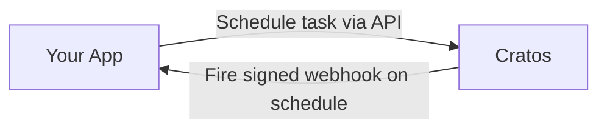

# Cratos

<div align="center">

**Schedule HTTP jobs dynamically — per user, per event, without building your own scheduler.**

[](https://opensource.org/licenses/MIT)
[](https://hub.docker.com/r/Ghiles1010/Cratos)

</div>

---

Cratos is a scheduling backend for apps that need to create jobs dynamically — per user, per event, with custom payloads. Your app calls the API, Cratos handles the timing, retries, signing, and execution history.

The moment you need to schedule jobs per user, a static config stops working:

- User signs up → schedule a follow-up in 3 days
- Order placed → remind if not shipped in 48h
- AI agent finishes a step → schedule the next one with the result as payload

**Without Cratos**, you're writing this:

```python
# somewhere in your codebase, forever
while True:
    jobs = db.get_due_jobs()
    for job in jobs:
        try:
            requests.post(job.url, json=job.payload)
        except Exception:
            retry_with_backoff(job)
    time.sleep(10)
```

**With Cratos**, your app just reacts to events:

```python
# user just signed up
def on_user_signup(user):
    cratos.schedule(
        url=f"https://myapp.com/users/{user.id}/follow-up",
        delay_seconds=259200,  # 3 days later
        payload={"user_id": user.id, "plan": user.plan}
    )
```

Cratos calls your endpoint at the right time, retries on failure, and gives you full execution history. No code runs inside Cratos — your services stay where they are.

## How it works



1. Your backend receives an event (user signs up, order placed, agent step done)
2. You POST a task to Cratos with a URL, schedule, and payload
3. Cratos stores, schedules, and retries automatically
4. Your endpoint receives the signed webhook at the right time


## Why not just use...

| | HTTP native | Dynamic API | No code | Self-hosted | No vendor | No per-call cost | HTTP first-class | Scheduling UI | Execution history |
|---|:---:|:---:|:---:|:---:|:---:|:---:|:---:|:---:|:---:|
| **Cron** | ❌ | ❌ | ❌ | ✅ | ✅ | ✅ | ❌ | ❌ | ❌ |
| **Celery Beat** | ❌ | ❌ | ❌ | ✅ | ✅ | ✅ | ❌ | ❌ | ❌ |
| **Windmill** | ✅ | ✅ | ❌ | ✅ | ✅ | ✅ | ✅ | ⚠️ | ✅ |
| **EventBridge** | ⚠️ | ✅ | ⚠️ | ❌ | ❌ | ❌ | ❌ | ⚠️ | ✅ |
| **Cratos** | ✅ | ✅ | ✅ | ✅ | ✅ | ✅ | ✅ | ✅ | ✅ |

> ⚠️ = possible but not the primary use case  
> EventBridge is built to trigger AWS services (Lambda, SQS, SNS) — calling an external HTTP endpoint requires setting up API Destinations with IAM policies and connection resources

## Quick Start

**Prerequisites:** Docker and Docker Compose.

```bash
curl -L -o docker-compose.yml https://github.com/Ghiles1010/Cratos/releases/latest/download/docker-compose.yml
docker compose up -d
```

| Service  | URL |
|----------|-----|
| Web UI   | http://localhost:3001 |
| API Docs | http://localhost:9101/api/docs/ |

Default credentials: `admin` / `admin` — change them via `.env` (see `.env.example`) or from the UI under **Account**.

## Features

- **Flexible scheduling** — one-off, cron, and interval tasks with timezone support
- **Retry policies** — fixed, linear, and exponential backoff
- **Execution history** — full audit trail with HTTP response, timings, and errors per run
- **Failure visibility** — see exactly why a task failed, how many times, and what your endpoint returned
- **Webhook signing** — HMAC-SHA256 so your endpoints can verify requests come from Cratos
- **Web UI** — manage tasks, inspect executions, rotate credentials
- **REST API** — full programmatic access with OpenAPI docs

## API Usage

Get your API key from the UI (Secrets page) or via:

```bash
curl -X POST http://localhost:9101/api/auth/get-api-key/ \
  -H "Content-Type: application/json" \
  -d '{"username": "admin", "password": "admin"}'
```

### One-off task
```bash
curl -X POST http://localhost:9101/api/tasks/ \
  -H "Authorization: Api-Key YOUR_KEY" \
  -H "Content-Type: application/json" \
  -d '{
    "task_name": "send-report",
    "callback_url": "https://your-service.com/webhook",
    "schedule_type": "one_off",
    "schedule_time": "2026-04-01T09:00:00Z"
  }'
```

### Cron task
```bash
curl -X POST http://localhost:9101/api/tasks/ \
  -H "Authorization: Api-Key YOUR_KEY" \
  -H "Content-Type: application/json" \
  -d '{
    "task_name": "daily-digest",
    "callback_url": "https://your-service.com/webhook",
    "schedule_type": "cron",
    "cron_expression": "0 9 * * *",
    "task_timezone": "America/New_York"
  }'
```

### Interval task
```bash
curl -X POST http://localhost:9101/api/tasks/ \
  -H "Authorization: Api-Key YOUR_KEY" \
  -H "Content-Type: application/json" \
  -d '{
    "task_name": "health-check",
    "callback_url": "https://your-service.com/webhook",
    "schedule_type": "interval",
    "interval_seconds": 30,
    "retry_policy": "exponential",
    "max_retries": 3
  }'
```

Cratos POSTs to your `callback_url` with a signed JSON payload. Your endpoint just needs to respond with a 2xx.

## Webhook Signing

Every outbound request includes:

```
X-Cratos-Timestamp: 1709041234
X-Cratos-Signature: sha256=a3f1...
```

**Verification (Python):**

```python
import hashlib, hmac, time

def verify(payload_bytes, headers, secret, max_age_seconds=300):
    timestamp = headers["X-Cratos-Timestamp"]
    if abs(time.time() - int(timestamp)) > max_age_seconds:
        raise ValueError("Stale request")
    signed = f"{timestamp}.".encode() + payload_bytes
    expected = "sha256=" + hmac.new(secret.encode(), signed, hashlib.sha256).hexdigest()
    if not hmac.compare_digest(expected, headers["X-Cratos-Signature"]):
        raise ValueError("Invalid signature")
```

Get your signing secret from the UI (Secrets page).

## Security

- **Outbound allowlist** — callback URLs must come from pre-approved origins (prevents SSRF)
- **Redirect blocking** — 3xx responses are treated as errors, not followed
- **API key auth** — `Authorization: Api-Key <key>` for all programmatic access

**No outbound requests are made by default.** Cratos enforces an allowlist of origins — a callback URL is rejected unless its origin has been explicitly whitelisted. This prevents SSRF attacks and ensures Cratos only ever calls endpoints you control. Add origins from the UI under **Origins**, or via the API below.

If your receiver runs on the same host as Cratos, use `host.docker.internal` instead of `localhost` — inside Docker, `localhost` resolves to the container, not your machine.

```bash
curl -X POST http://localhost:9101/api/webhooks/allowed-origins/ \
  -H "Authorization: Api-Key YOUR_KEY" \
  -H "Content-Type: application/json" \
  -d '{"scheme": "https", "host": "your-service.com", "port": 443}'
```

## License

MIT — see [LICENSE](LICENSE).
