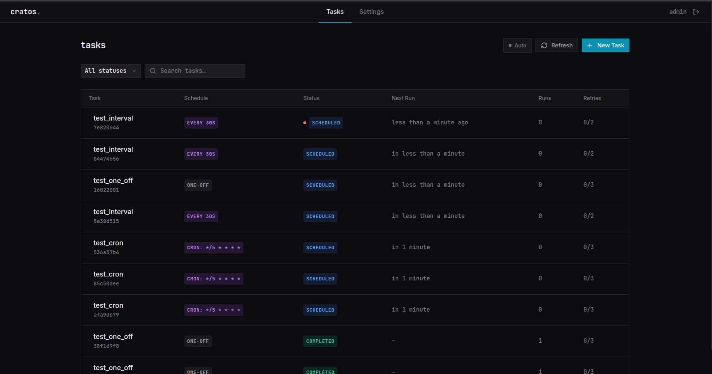
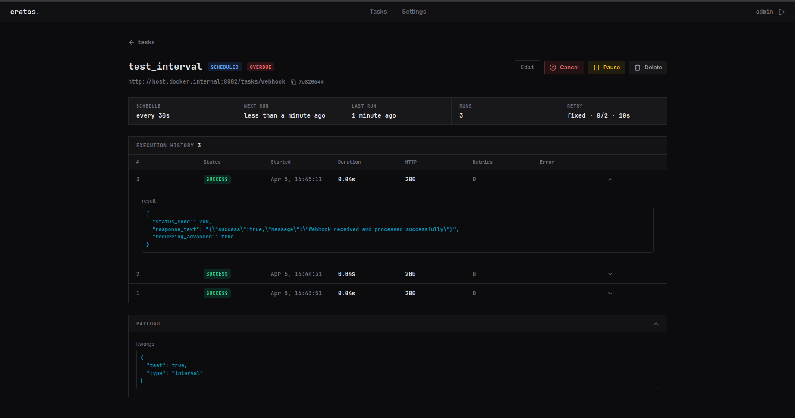

# Cratos

<div align="center">

**Self-hosted webhook scheduler with a built-in web UI**

[](https://opensource.org/licenses/MIT)
[](https://www.python.org/)
[](https://reactjs.org/)

</div>

---

Cratos calls your HTTP endpoints on a schedule. That's it.

Register a URL, pick a schedule (one-off, cron, or interval), and Cratos fires a signed POST request at the right time — with retries, execution history, and a web UI to manage everything. No code to deploy inside Cratos. Your services stay where they are.

## Why not just use...

| | HTTP native | Dynamic API | No code | Self-hosted | No vendor | No per-call cost | HTTP first-class | Scheduling UI | Execution history |
|---|:---:|:---:|:---:|:---:|:---:|:---:|:---:|:---:|:---:|
| **Cron** | ❌ | ❌ | ❌ | ✅ | ✅ | ✅ | ❌ | ❌ | ❌ |
| **Celery Beat** | ❌ | ❌ | ❌ | ✅ | ✅ | ✅ | ❌ | ❌ | ❌ |
| **Windmill** | ✅ | ✅ | ❌ | ✅ | ✅ | ✅ | ✅ | ⚠️ | ✅ |
| **EventBridge** | ⚠️ | ✅ | ⚠️ | ❌ | ❌ | ❌ | ❌ | ⚠️ | ✅ |
| **Cratos** | ✅ | ✅ | ✅ | ✅ | ✅ | ✅ | ✅ | ✅ | ✅ |

> ⚠️ = possible but not the primary use case
> EventBridge is built to trigger AWS services (Lambda, SQS, SNS) — calling an external HTTP endpoint requires setting up API Destinations with IAM policies and connection resources

**The sweet spot:** you have services that already expose HTTP endpoints and need something to trigger them reliably on a schedule — without writing code inside a platform, paying per invocation, or depending on AWS.

## Screenshots

### Tasks Dashboard


### Task Details


### Metrics Dashboard


## Features

- **Flexible Scheduling** — one-off, cron expressions, and interval-based tasks with timezone support
- **Retry Policies** — fixed, linear, and exponential backoff
- **Execution History** — full audit trail with HTTP response details, timings, and error traces
- **Webhook Signing** — HMAC signatures so your endpoints can verify requests come from Cratos
- **Web UI** — manage tasks, view metrics, and handle API keys from the browser
- **REST API** — full programmatic access

## Quick Start

**Prerequisites:** Docker and Docker Compose.

```bash
git clone https://github.com/Ghiles1010/Cratos.git
cd Cratos
docker compose up -d --build
```

| Service | URL |
|---------|-----|
| Web UI  | http://localhost:3001 |
| REST API | http://localhost:9101 |

- Default credentials are `admin` / `admin`. Override by setting `CRATOS_ADMIN_USERNAME` and `CRATOS_ADMIN_PASSWORD` as environment variables or in an optional `.env` file (see `.env.example`).
- On a remote host, set `CRATOS_API_URL` to the public address of your Cratos instance.

## API Usage

### Schedule a task

```bash
curl -X POST http://localhost:9101/api/tasks/ \
  -H "Authorization: Api-Key YOUR_API_KEY" \
  -H "Content-Type: application/json" \
  -d '{
    "task_name": "daily_report",
    "callback_url": "https://your-service.com/webhooks/daily-report",
    "schedule_type": "cron",
    "cron_expression": "0 9 * * *"
  }'
```

Cratos will POST to `callback_url` every day at 9am with a signed JSON payload containing the task metadata. Your endpoint just needs to respond with a 2xx.

### List tasks

```bash
curl http://localhost:9101/api/tasks/ \
  -H "Authorization: Api-Key YOUR_API_KEY"
```

## Security Model

Cratos makes outbound HTTP requests on your behalf, so it enforces two complementary controls: it only calls URLs you explicitly permit, and it signs every request so your endpoints can verify the call is genuine.

### Outbound request allowlist

Before any callback URL can be registered or fired, its **origin** (scheme + host + port) must appear in the `AllowedOrigin` table. Everything else is rejected at validation time — a task whose URL is not on the list cannot be created at all.

This is the primary defence against SSRF (Server-Side Request Forgery): a user cannot instruct Cratos to probe internal services, cloud metadata endpoints, or arbitrary hosts on your network.

**Normalisation rules applied before comparison:**

| Input | Stored as |
|---|---|
| `https://hooks.example.com` | `https / hooks.example.com / 443` |
| `http://internal.local` | `http / internal.local / 80` |
| `http://internal.local:8080/path` | `http / internal.local / 8080` |
| `HTTPS://Hooks.Example.Com.` | `https / hooks.example.com / 443` |

- Scheme must be `http` or `https` — no other protocols are accepted.
- Host is lowercased and trailing dots are stripped before comparison.
- If the URL omits a port, the default for the scheme is assumed (`80` for http, `443` for https). An explicit port must match exactly.

**Managing the allowlist** requires Django admin/staff privileges (`IsAdminUser`). Regular users can only register callback URLs that already belong to an approved origin.

```bash
# Add an allowed origin via the API (admin credentials required)
curl -X POST http://localhost:9101/api/webhooks/allowed-origins/ \
  -H "Authorization: Api-Key ADMIN_KEY" \
  -H "Content-Type: application/json" \
  -d '{"scheme": "https", "host": "hooks.example.com", "port": 443}'
```

### Webhook signing

Every outbound request carries two headers that let your endpoint verify the call came from Cratos and has not been replayed:

```
X-Cratos-Timestamp: 1709041234
X-Cratos-Signature: sha256=a3f1...
```

The signature is an **HMAC-SHA256** computed over `"{timestamp}.{raw_body}"` using a per-user secret. The signed message intentionally includes the timestamp so that receivers can reject requests with a stale timestamp (the convention is to refuse anything older than 5 minutes).

**Verification example (Python):**

```python
import hashlib, hmac, time

def verify(payload_bytes, headers, secret, max_age_seconds=300):
    timestamp = headers["X-Cratos-Timestamp"]
    if abs(time.time() - int(timestamp)) > max_age_seconds:
        raise ValueError("Request is too old — possible replay attack")

    signed_content = f"{timestamp}.".encode() + payload_bytes
    expected = "sha256=" + hmac.new(
        secret.encode(), signed_content, hashlib.sha256
    ).hexdigest()

    if not hmac.compare_digest(expected, headers["X-Cratos-Signature"]):
        raise ValueError("Invalid signature")
```

**Key management:** each user has one signing secret, automatically generated on first use. It can be rotated at any time — the new secret takes effect immediately for all subsequent requests.

```bash
# Rotate your signing secret
curl -X POST http://localhost:9101/api/webhooks/signing-key/ \
  -H "Authorization: Api-Key YOUR_API_KEY"
```

### Redirect blocking

The HTTP client sends all webhook requests with `allow_redirects=False`. This means a server-side redirect (3xx) is treated as an error rather than followed. Without this, an allowlisted origin could silently redirect Cratos to a non-allowlisted destination, bypassing the allowlist entirely.

### Authentication

Cratos supports two authentication methods that can be used interchangeably:

| Method | Header | Use case |
|---|---|---|
| Session cookie | (set by browser after login) | Web UI |
| API key | `Authorization: Api-Key <key>` | scripts, CI |

Each user has exactly one API key. Keys can be regenerated at any time via `POST /api/keys/` or from the UI. The `last_used` timestamp is updated on every authenticated request for audit purposes.

### Resource isolation

All task queries are automatically filtered to the authenticated user. A user cannot read, modify, cancel, or delete another user's tasks, regardless of the task ID they supply. Signing keys and API keys follow the same per-user isolation.

## License

MIT License — see [LICENSE](LICENSE) file for details.
